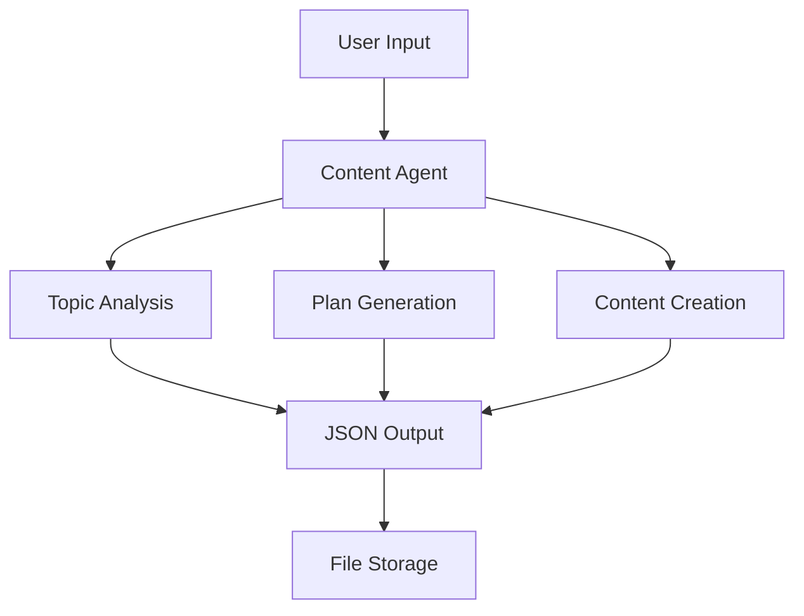

# Content Pipeline AI - Rapid Prototype

A demonstration of rapid AI prototype development using Google's Gemini API to create an automated content strategy and generation system.


## 🚀 Quick Start

```bash
# Clone the repository
git clone https://github.com/yourusername/content-pipeline-ai

# Install dependencies
pip install -r requirements.txt

# Set up your API key
export GOOGLE_API_KEY='your_api_key_here'

# Run the application
python content_agent.py
```

## 🎯 Core Features

### 1. Content Strategy Analysis
- Market research and gap analysis
- Trend identification
- Target audience insights
- SEO opportunity mapping

Example output:
```json
{
  "market_research": {
    "target_audience": [
      "Tech-savvy professionals aged 25-40",
      "Digital marketing specialists"
    ],
    "content_gaps": [
      "In-depth technical tutorials",
      "Case studies with ROI metrics"
    ]
  }
}
```

### 2. Content Plan Generation
- Monthly themes development
- Weekly content calendar
- Multi-platform content strategy
- SEO-optimized content briefs

Example calendar:
```json
{
  "monthly_themes": [
    {
      "month": "March",
      "theme": "Spring Renewal",
      "focus_areas": ["Nature's Awakening", "Personal Growth"]
    }
  ]
}
```

### 3. Content Creation
- Blog posts and articles
- Social media content
- Newsletter snippets
- Engagement elements

Example content:
```json
{
  "main_content": {
    "title": "Spring's Symphony: Nature's Awakening",
    "word_count": 1500,
    "sections": [
      {
        "heading": "The Awakening Earth",
        "content": "As winter fades..."
      }
    ]
  }
}
```

## 🛠️ Technical Architecture



## 📊 Development Process

1. **Day 1: Initial Concept**
   - Problem identification
   - API exploration
   - Basic architecture design

2. **Day 2: Core Implementation**
   - JSON handling system
   - Error management
   - State tracking

3. **Day 3: Feature Expansion**
   - Content generation
   - Plan creation
   - System integration

## 📈 Results & Metrics

- **Development Time**: 3 days from concept to working prototype
- **Code Quality**: Clean, modular architecture with comprehensive error handling
- **Functionality**: Complete content pipeline with analysis, planning, and creation
- **Scalability**: Extensible design for future features

## 🎥 Demo


## 🔧 Technical Stack

- Python 3.x
- Google Gemini API
- JSON Processing
- State Management
- Error Handling

## 📝 Example Outputs

### Content Analysis


### Content Plan


### Generated Content


## 🚀 Future Enhancements

1. Performance Optimization
   - Content quality metrics
   - SEO score analysis
   - Engagement predictions

2. Export Features
   - Multiple format support
   - Platform-specific formatting
   - Batch processing

3. Analytics Integration
   - Performance tracking
   - A/B testing
   - ROI measurement

## 📚 Documentation

- [Installation Guide](docs/installation.md)
- [API Documentation](docs/api.md)
- [Usage Examples](docs/examples.md)
- [Contributing Guidelines](CONTRIBUTING.md)

## 🤝 Contributing

Contributions are welcome! Please read our [Contributing Guidelines](CONTRIBUTING.md) for details.

## 📄 License

This project is licensed under the MIT License - see the [LICENSE](LICENSE) file for details.

## 🙏 Acknowledgments

- Google Gemini API team
- Open source community
- All contributors

## 📞 Contact

- Website: [aayushjain.space](https://aayushjain.space)
- GitHub: [@yourusername](https://github.com/yourusername)
- LinkedIn: [Your Name](https://linkedin.com/in/yourprofile)